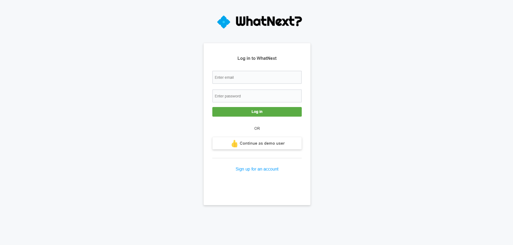
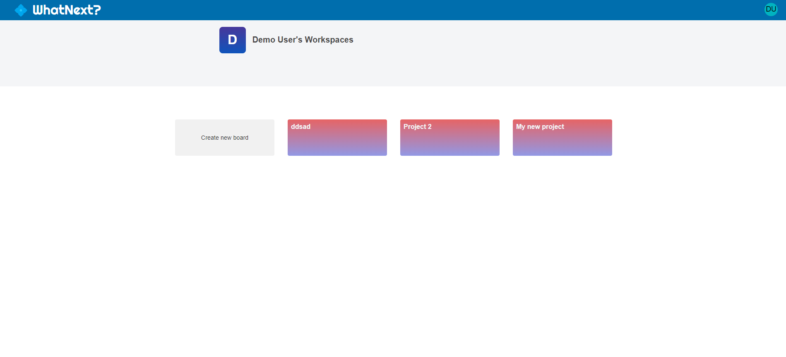
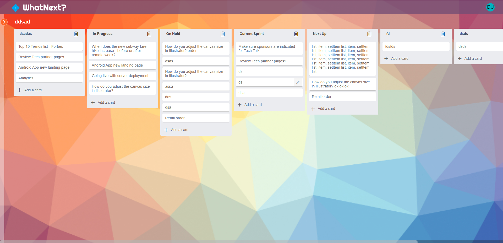

# WhatNext?

Check out WhatNext? here: [WhatNext?](https://whatnext-app.herokuapp.com/)

WhatNext? is a clone of project management app, Trello.  The backend was made with Python using Flask, SQLAlchemy, WTForms, and Alembic.  The frontend was developed with React and Redux.  All styling was done without CSS Libraries or frameworks.

## Landing Page

WhatNext? requires users to register and create an account before accessing it's features.  Upon successful login, users are directed to a homepage where they can create new workspaces or interact with their previously made workspaces.  Passwords are hashed and stored in the database.  Any attempted navigation to other sections of the site, without authentication, will result in the user being redirected to the landing page.

## Home Page

Once authenticated, users are able to created new workspaces and interact with their previously made workspaces.  Once a workspace has been created or selected, users are directed to the board display page where they can begin to create and manage their projects.

## Workspace Page

Inside of the workspace page, users are able to createlists and cards for their lists.  Cards are are able to be to be dragged and dropped into other lists as the actions are completed.  Users can switch between their workspaces via the sidebar menu.
